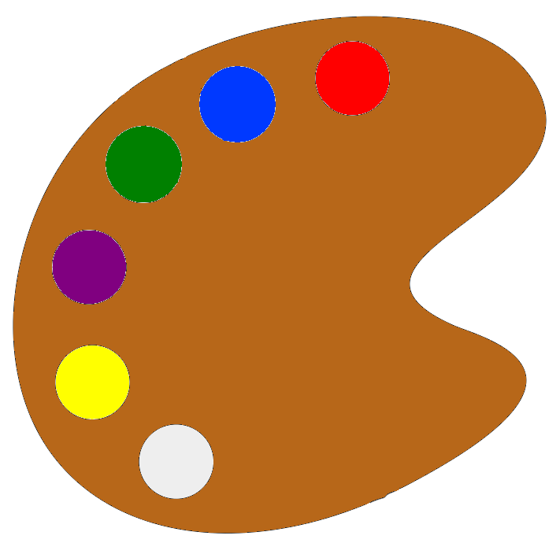
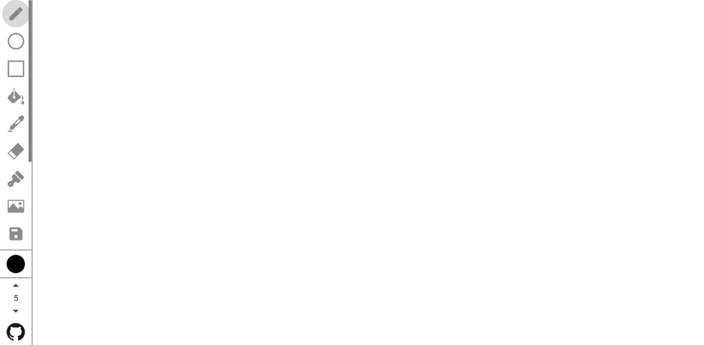

<!-- PROJECT SHIELDS -->
<!--
*** I'm using markdown "reference style" links for readability.
*** Reference links are enclosed in brackets [ ] instead of parentheses ( ).
*** See the bottom of this document for the declaration of the reference variables
*** for contributors-url, forks-url, etc. This is an optional, concise syntax you may use.
*** https://www.markdownguide.org/basic-syntax/#reference-style-links
-->

[![Contributors][contributors-shield]][contributors-url]
[![Forks][forks-shield]][forks-url]
[![Stargazers][stars-shield]][stars-url]
[![Issues][issues-shield]][issues-url]
[![MIT License][license-shield]][license-url]
[![Netlify Badge][netlify-shield]][netlify-deploy-url]

<!-- PROJECT LOGO -->
 

  

  <h3 align="center">Landscape</h3>

  

    A simple drawing application to show your creativity
     
     
    <a href="https://landscape-app.netlify.app/">View Demo</a>
    ·
    <a href="https://github.com/priyanshurav/landscape/issues">Report Bug</a>
    ·
    <a href="https://github.com/priyanshurav/landscape/issues">Request Feature</a>
  

<!-- TABLE OF CONTENTS -->

  
Table of Contents

  <ol>
    <li>
      <a href="#about-the-project">About The Project</a>
      <ul>
        <li><a href="#built-with">Built With</a></li>
      </ul>
    </li>
    <li><a href="#roadmap">Roadmap</a></li>
    <li><a href="#contributing">Contributing</a></li>
    <li><a href="#license">License</a></li>
  </ol>

<!-- ABOUT THE PROJECT -->

## About The Project

A simple and easy to use drawing application. It is completely free to use and open-source.

### Built With

Given below are some of the technologies used for making this application.

- [React](https://reactjs.org/)
- [TypeScript](https://www.typescriptlang.org/)
- [Material UI](https://material-ui.com/)

<!-- ROADMAP -->

## Roadmap

See the [open issues](https://github.com/priyanshurav/landscape/issues) for a list of proposed features (and known issues).

<!-- CONTRIBUTING -->

## Contributing

Contributions are what make the open source community such an amazing place to be learn, inspire, and create. Any contributions you make are **greatly appreciated**. See the [contributing guidelines](https://github.com/priyanshurav/landscape/blob/main/CONTRIBUTING.md) for more info.

<!-- LICENSE -->

## License

This software is licensed under the [MIT License](https://choosealicense.com/licenses/mit/). See the [LICENSE](https://github.com/priyanshurav/landscape/blob/main/LICENSE) for more info

<!-- MARKDOWN LINKS & IMAGES -->
<!-- https://www.markdownguide.org/basic-syntax/#reference-style-links -->

[contributors-shield]: https://img.shields.io/github/contributors/priyanshurav/landscape.svg?style=for-the-badge&color=green
[contributors-url]: https://github.com/priyanshurav/landscape/graphs/contributors
[forks-shield]: https://img.shields.io/github/forks/priyanshurav/landscape.svg?style=for-the-badge
[forks-url]: https://github.com/priyanshurav/landscape/network/members
[stars-shield]: https://img.shields.io/github/stars/priyanshurav/landscape.svg?style=for-the-badge
[stars-url]: https://github.com/priyanshurav/landscape/stargazers
[issues-shield]: https://img.shields.io/github/issues/priyanshurav/landscape.svg?style=for-the-badge
[issues-url]: https://github.com/priyanshurav/landscape/issues
[license-shield]: https://img.shields.io/github/license/priyanshurav/landscape.svg?style=for-the-badge
[license-url]: https://github.com/priyanshurav/landscape/blob/main/LICENSE
[netlify-shield]: https://img.shields.io/netlify/adb24a7e-2c3e-4e80-8d04-7b576c9d7fcc?logo=netlify&style=for-the-badge
[netlify-deploy-url]: https://app.netlify.com/sites/landscape-app/deploys
